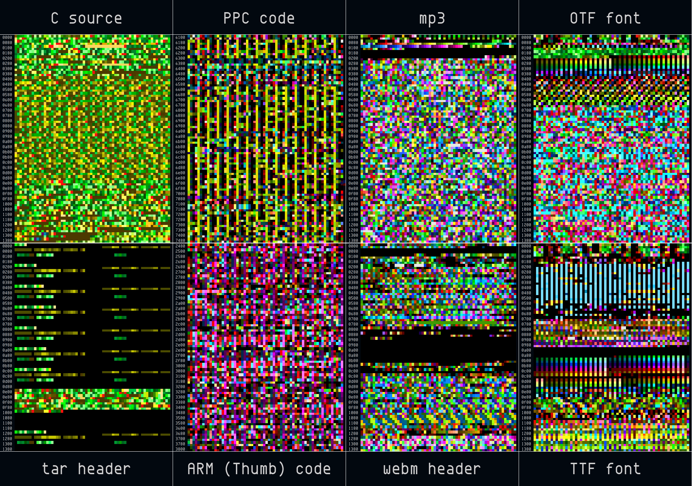

**pixd** is a tool for visualizing binary data using a colour palette.  It is
in a lot of ways akin to a hexdump tool, except using coloured squares to
represent each octet.

pixd uses 24-bit color SGR escape sequences.  For a list of terminal
emulators with support for these, see [XVilka's list of supporting terminal
emulators][1].

## Screenshot

## License
MIT license.  Enjoy!

[1]: https://gist.github.com/XVilka/8346728
